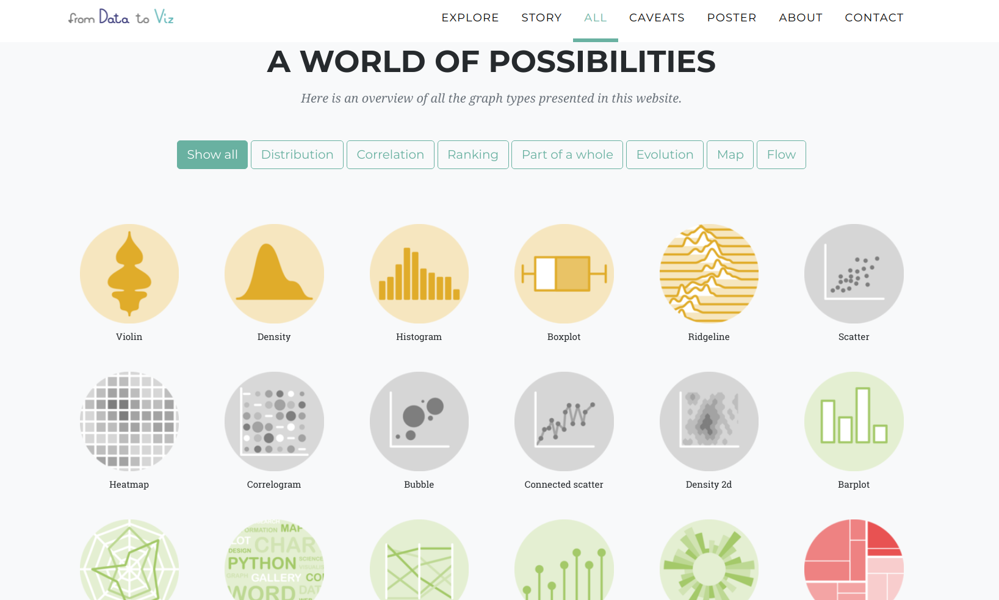

```{r echo=FALSE}
# para poder luego mostrar como desactivamos la notación científica
options(scipen = 0)
```

# Visualización

```{r echo=FALSE, out.width="100%"}

```

La visualización de información es una de las técnica más poderosas, y a la vez más accesibles, de las que disponemos como analistas de datos. La visualización es el proceso de hacer visibles los contrastes, ritmos y eventos que los datos expresan, que no podemos percibir cuando vienen en forma de áridas listas de números y categorías.

Vamos a aprender a realizar las visualizaciones más usadas, y las opciones de ajuste con las que podemos lograr que luzcan tal como queremos.


## Una buena visualización para empezar: el _scatterplot_

Los gráficos de dispersión, o _scatterplots_, son quizás el tipo de visualización más conocido. Consisten en puntos proyectados en un eje de coordenadas, donde cada punto representa una observación. Son útiles para mostrar la correlación entre dos variables numéricas.

Por ejemplo, podríamos asumir que existirá una correlación positiva entre la cantidad de habitantes de una comuna y la cantidad anual de delitos. Es decir que, cuantas más personas vivan en una comuna, es de esperarse que sea mayor la cantidad de robos, hurtos, siniestros viales y homicidios que ocurren allí.

Activamos el paquete `tidyverse`, si aún no lo habíamos hecho.  

```{r eval=FALSE}
library(tidyverse)
```

Y si no lo tenemos ya cargado, leemos de nuevo el dataset con los registros de delitos (esta versión incluye la columna "comuna"). 

```{r }
delitos <- read.csv("https://cdaj.netlify.app/data/delitos_barrios_comunas.csv")
```

Usando los verbos de transformación que aprendimos, es fácil obtener un dataframe resumen con indicadores a nivel comuna. Vamos a analizar la cantidad de homicidios.

```{r}
homicidios_por_comuna <- delitos %>% 
    filter(tipo == "Homicidio") %>% 
    group_by(comuna) %>% 
    summarise(homicidios = sum(total))

homicidios_por_comuna
```

Lo que nos falta ahora es la cantidad de habitantes en cada comuna. _No problem_. El dato es fácil de conseguir, otra vez cortesía de la Dirección General de Estadística y Censos de la Ciudad de Buenos Aires. Traemos la proyección al año 2020 de la cantidad de habitantes por comuna. 

```{r}
poblacion <- read.csv("https://cdaj.netlify.app/data/comunas_poblacion_2020.csv")

poblacion
```

Por suerte, ya sabemos como combinar tablas usando `left_join()`

```{r}
homicidios_por_comuna <- homicidios_por_comuna %>% left_join(poblacion)

homicidios_por_comuna
```


!Preparativos terminados! Hagamos por fin nuestro _scatterplot_. Tal como en el capítulo de introducción a R, continuaremos usando `ggplot()` para visualizar:

```{r}
ggplot(homicidios_por_comuna)
```

¿Un gráfico vacío? Recordemos que ggplot funciona por capas. Primero uno declara el dataframe que va a usar, y luego agrega una o más capas con representaciones de la información. La forma de agregar una capa con un scatterplot, en la práctica dibujar puntos, es con `geom_point`:

```{r}
ggplot(homicidios_por_comuna) + geom_point(aes(x = poblacion, y = homicidios))
```

Lo que hicimos fue pedirle a ggplot que dibuje un punto por cada fila (representando a cada comuna), con la posición en el eje de las `x`  según su población, y en el eje de las `y` según la cantidad de contactos registrados. Estas referencias estéticas (_aesthetics_ en inglés) son las que van dentro de la función `aes()` en `geom_point(aes(x = poblacion, y = homicidios))`

En el extremo superior derecho hay una comuna que sobresale. Podemos identificarla, pidiendo a ggplot que agregue una variable más a la visualización -la comuna. Siendo un gráfico en dos dimensiones, ya no podemos usar la posición para representar un valor; tanto la posición horizontal como la vertical están siendo usadas por población y total. Nuestras opciones son codificar la comuna por color, forma o tamaño del punto. A pesar de que son identificadas con números, las comunas son una variable categórica: no tiene sentido decir que la comuna 1 es "menor" que la comuna 7. Par las variables categóricas, el color suele ser una buena opción de codificación. 

Lo hacemos agregando un parámetro `color` dentro de `aes()`. Tal como hicimos en el capítulo 2, usamos `factor(comuna)` en lugar de `comuna` a secas para indicarle a R que queremos que trate a la variable como categórica:


```{r}
ggplot(homicidios_por_comuna) + 
    geom_point(aes(x = poblacion, y = homicidios, color = factor(comuna)))
```

En ese caso, no es tan fácil discernir cuál es cuál, pero mirando con cuidado descubrimos que la comuna 1 es la que tiene mayor población y donde se reportaó la mayor cantidad de homicidios. Lo que nos pasa aquí es que tenemos demasiadas categorías, con lo cual cada una tiene su propio color pero el rango cromático no alcanza para darle a cada una un tono bien distinto al de las demás. 

Si necesitamos generar un gráfico que no deje lugar a dudas, lo resolvemos usando un método alternativo para el scatterplot. En lugar de dibujar puntos, podemos poner etiquetas con el nombre de cada comuna.

En lugar de 

```{r eval=FALSE}
ggplot(homicidios_por_comuna) + 
    geom_point(aes(x = poblacion, y = homicidios, color = factor(comuna)))
```

usamos

```{r}
ggplot(homicidios_por_comuna) + 
    geom_label(aes(x = poblacion, y = homicidios, label = factor(comuna)))
```

Volvamos a nuestros puntos para practicar dos codificaciones estéticas que no hemos probado, color y tamaño.

Para dejar aún más clara la diferencia de homicidios entre comunas, podríamos usar el tamaño (_size_) de cada punto para representar esa variable, además de su altura en el gráfico.

```{r}
ggplot(homicidios_por_comuna) + 
    geom_point(aes(x = poblacion, y = homicidios, size = homicidios))
```

Y para distinguir cuál es cuál, podemos pedirle a ggplot que cambie la forma (_shape_) de cada punto según la comuna a la que corresponde.

```{r}
ggplot(homicidios_por_comuna) + 
    geom_point(aes(x = poblacion, y = homicidios, shape = factor(comuna)))
```

¡Hey, sólo aparecen seis de las comunas! `ggplot()` usa cómo máximo 6 formas distintas, debido a que una cantidad mayor sería de veras muy difícil de discernir para nuestros pobres ojos. Moraleja: la estética `shape` sirve sólo cuando manejamos pocas categorías. De todas formas podría opinarse que es el método de codificación que menos gracia tiene, así que no es grave que su utilidad sea limitada.

## Ajustando color y tamaño

Hemos visto que especificando atributos estéticos y las variables que representan dentro 
de `aes()` podemos ajustas posición, tamaño, color y hasta la forma de los puntos de acuerdo a sus valores. Pero, ¿qué pasa si queremos usar un tamaño o un color arbitrario para nuestros puntos? Es decir, si no nos gusta el color negro y queremos que sean todos azules, o si nos parece que se ven pequeños y queremos que sean todos un poco más grandes. Fácil: definimos el `color` o `size` que queremos por fuera de las función `aes()`, y será aplicado a todos los puntos.

```{r}
ggplot(homicidios_por_comuna) + 
    geom_point(aes(x = poblacion, y = homicidios), color = "blue")
```

Obsérvese que `color = "blue"` está escrito por fuera de los paréntesis de `aes()`. De paso, hicimos uso de una característica muy práctica de R: reconoce un montón de colores por su nombre, siempre que los escribamos entre comillas. Si le decimos `color = "blue"`, `color = "red"`, `color = "yellow"`, etc., sabe de que hablamos. Una lista de todos los colores que R reconoce, ideal como referencia, se puede encontrar en http://www.stat.columbia.edu/~tzheng/files/Rcolor.pdf ; ¡son más de 600!. 

Tras un vistazo a la lista, me decido por "darkolivegreen4":

```{r}
ggplot(homicidios_por_comuna) + 
    geom_point(aes(x = poblacion, y = homicidios), color = "darkolivegreen4")
```

Queda claro que podemos asignar el color que queramos.

En cuanto al tamaño, la fórmula es la misma:


```{r}
ggplot(homicidios_por_comuna) + 
    geom_point(aes(x = poblacion, y = homicidios), size = 5)
```

El valor de `size` se da en píxeles. Es una medida difícil de estimar antes de ver el resultado, pero es cuestión de probar algunos valores distintos hasta encontrar el que nos va bien. Por supuesto, podemos ajustar varios, o todos, los atributos a la vez

```{r}
ggplot(homicidios_por_comuna) + 
    geom_point(aes(x = poblacion, y = homicidios), 
               size = 9, color = "chocolate3", shape = 0)
```


## Facetado

Ya sabemos como representar variables usando atributos estéticos. Con esa técnica podemos mostrar con claridad dos o tres variables en un plano bidimensional (nuestro gráfico). Pero cuando si queremos agregar más atributos para codificar variables adicionales, la visualización pierde legibilidad de inmediato. Por suerte existe otra técnica, que podemos usar en combinación con la estética, para agregar aún más variables: el facetado.

Las facetas son múltiples gráficos contiguos, con cada uno mostrando un subconjunto de los datos. Son útiles sobre todo para variables categóricas.

Practiquemos con un ejemplo. Sabemos que en la comuna 1 se registra una cantidad de homicidios mayor que en las demás. ¿La diferencia será igual para todas las categorías de homicidio, o existe alguna en particular que es la que inclina la balanza?

En nuestro dataframe original, para cada incidente tenemos las columnas "tipo" y  "subtipo". Para revisar rápido cuales son las combinaciones posibles de éstas categorías podemos armar una _tabla de contingencia_, un conteo de las combinaciones de categorías según aparecen en nuestros datos. Presentemos entonces a la función `count()`, que nos puede dar una mano. 

```{r}
delitos %>% 
    count(tipo, subtipo)
```

Para el tipo "Homicidio" encontramos los subtipos "Doloso", "Femicidio", Femicidio Intrafamiliar", "Siniestro Vial", y "Travesticidio/Transfemicidio". Podemos usar esas subcategorías para mostrar como componen el total de homicidios de cada comuna.

Agrupamos entonces nuestra data de homicidios por comuna y también por subtipo, sin olvidar agregar luego los datos de población  

```{r}
homicidios_por_comuna_y_subtipo <- delitos %>% 
    filter(tipo == "Homicidio") %>% 
    group_by(comuna, subtipo) %>% 
    summarise(homicidios = sum(total)) %>% 
    left_join(poblacion)

head(homicidios_por_comuna_y_subtipo)

```

Listos para facetar. Producimos un scatterplot igual que antes, y le agregamos una capa adicional con `facet_wrap()`. La variable a "facetar", la que recibirá un gráfico por cada una de sus categorías, siempre se escribe a continuación del signo `~`; en nuestro caso, queda como `~subtipo`. El simbolillo en cuestión denota lo que en R se denomina una _fórmula_ y ya nos lo cruzaremos de nuevo, pero por ahora no le prestamos más atención.


```{r}
ggplot(homicidios_por_comuna_y_subtipo) + 
    geom_point(aes(x = poblacion, y = homicidios)) +
    facet_wrap(~subtipo)
```

La notable cantidad de casos en la comuna 1 se debe a los homicidios dolosos; en ninguna otra categoría se separa tanto del resto. ¿Qué tiene de particular esta comuna? Es la más poblada, si, pero aún en proporción per cápita parece separarse de las demás (junto con otra comuna, la 4, que le sigue en población y en número de casos).

Vale la pregunta, por ahora sin respuesta, para mencionar algo fundamental: por más ciencia de datos que apliquemos, siempre vamos a llegar a un punto en que nuestros hallazgos no tendrán sentido sin combinarlos con lo que se llama "conocimiento de dominio". El conocimiento de dominio es el saber especializado sobre el tema que estamos tratando, sea el ciclo reproductivo de la gaviota austral o la organización administrativa del Gobierno de la Ciudad Autónoma de Buenos Aires. Esto no debería desanimarnos, ¡al contrario!. El análisis de datos como profesión conlleva un constante aprendizaje sobre los más variados temas. Y a la inversa: si somos expertos en cualquier campo, aún con un puñado de técnicas básicas de R podemos extraer conocimiento de nuestros datos que jamas encontraría una persona, aún experta en programación, que no conozca el contexto.


## Gráficos de barras

Si hay un tipo de visualización que compite en popularidad con el _scatterplot_, son los gráficos de barras (_bar charts_ en inglés). Solemos encontrarlos acompañando artículos en diarios y revistas, sin duda porque son fáciles de leer de un vistazo. Los gráficos de barras se usan mucho para hacer comparaciones: quién tiene más y quién tiene menos de alguna variable continua cómo ingresos, edad, altura o similares.

Comparemos la suma total de registros que alcanza cada barrio. Con `geom_bar` podemos agregar una capa de visualización con gráficos de barras. Los parámetros a definir dentro de `aes()` son `x`, donde va una variable categórica, y en forma opcional `weight`, que indica la variable a sumar para determinar la altura de cada barra. Si no especificamos un `weight`, simplemente se cuenta cuantas veces aparece cada categoría en el dataframe, en la práctica un conteo o frecuencia de aparición. En nuestro dataset cada fila incluye un período y un total de contactos recibidos. Nosotros no estamos interesados en cuantas veces aparece cada barrio, sino en la suma de la columna total para cada uno de ellos, así que vamos a usar `weight = total`. 

```{r}
ggplot(delitos) +
    geom_bar(aes(x = barrio, weight = total))
```

Tenemos un problema. Los nombres de los barrios resultan ilegibles, porque no tienen espacio suficiente para evitar que aparezcan superpuestos. En un gráfico, el eje horizontal es un muy mal lugar para poner muchas categorías con nombre, ya que el solapamiento se vuelve inevitable. Sería mejor tener los nombre en el eje vertical, donde se pueden escribir uno encima del otro sin pisarse ¡La solución es invertir los ejes de de coordenadas! Sólo necesitamos agregar `coord_flip`:

```{r fig.height=6}
ggplot(delitos) +
    geom_bar(aes(x = barrio, weight = total)) +
    coord_flip()
```

Ahora si podemos interpretar el gráfico. Además de identificar los barrios que acumulan más registros, este gráfico muestra una situación curiosa, que hasta podría indicar un error en la fuente de datos: en el barrio de La Boca aparentemente no han ocurrido delitos dignos de aparecer en el dataset. 

Los gráficos de barras, además de comparar, también son buenos para mostrar la composición interna de las cosas: que "hay dentro", que componentes contribuye a un determinado total. Vamos a mostrar entonces cuanto contribuye cada tipo de trámite al total por barrio, usando el parámetro estético `fill` (relleno). `geom_bar` realiza un segmentado automático de cada barra, con la proporción que le corresponde a cada subcategoría:

```{r fig.height=6}
ggplot(delitos) +
    geom_bar(aes(x = barrio, weight = total, fill = tipo)) +
    coord_flip()
```

Ahora se ve que robo y hurto son los tipos más frecuentes, en todos los barrios.

En lugar de relleno podríamos haber usado `color`, tal como hicimos con los puntos, pero los resultado es un poco menos legible y no luce tan bien. La variable `color` modifica la silueta de las barras, pero no su interior:

```{r fig.height=6}
ggplot(delitos) +
    geom_bar(aes(x = barrio, weight = total, color = tipo)) +
    coord_flip()
```

También podemos dejar de lado los barrios, y concentrarnos en las categorías. Si quisiéramos ver el total de registros por cada sub-tipo de incidente:

```{r}
ggplot(delitos) +
    geom_bar(aes(x = tipo, weight = total)) 
```

Notamos que los homicidios y lesiones son eventos poco frecuentes en comparación con las otras clases. En esta ocasión no recurrimos a `coord_flip`, ya que las categorías son pocas y tienen espacio suficiente en el eje horizontal.


¿Y si mostramos el aporte de cada barrio al total global de cada tipo de incidente?

```{r fig.height=6}
ggplot(delitos) +
    geom_bar(aes(x = tipo, weight = total, fill = barrio)) 
```

Hemos obtenido una visualización indigerible. ¡Son demasiadas categorías como para diferenciarlas por color!

Quizás con un facetado por barrio...


```{r fig.height=6}
ggplot(delitos) +
    geom_bar(aes(x = tipo, weight = total)) +
    facet_wrap(~barrio)
```

Esta opción es un poco mejor, ya que al menos permite identificar pronto los barrios salientes, y discernir diferencias generales si se la mira con paciencia. Una visualización tan densa en información puede resultar ideal para "uso personal", explorando de forma rápida datos con los que estamos familiarizados, pero es poco recomendable para compartir con otros. 

En general, para evitar la confusión asociada a variables con docenas de categorías se busca simplificar definiendo menos grupos. Por ejemplo, como hicimos al comienzo al separar por comunas, que son sólo quince, en lugar de por barrios. 


## Histogramas

Los histogramas son usados para mostrar la _distribución_ de una variable continua. El histograma permite  decir si los valores que toma cada observación se agrupan en torno a un valor "típico" o medio -como en el caso de la llamada _distribución normal_-, o en torno a dos valores frecuentes (_distribución bimodal_), o con dispersión sin picos ni valles, donde no hay valores típicos ni atípicos - _distribución uniforme_. 


Por ejemplo, veamos la distribución de los barrios respecto a la variable "cantidad anual de delitos". Para contabilizar el total de registros por barrio tenemos que agrupar los valores de esa columna, y hacer un resumen (`summarise()`) que extraiga el gran total:

```{r}
delitos_anuales <- delitos %>% 
    group_by(barrio) %>% 
    summarise(gran_total = sum(total))

delitos_anuales
```

:::tip
En la tabla de delistos anuales la primera fila tiene vacía la celda de barrio. Esto es porque representa los delitos para los cuales no se conoce el sitio donde ocurrieron. Es decir, muestra el total de delitos encontrados en filas donde la la variable "barrio" es `NA`.
:::

Hacer un histograma es simple con `geom_histogram()`: sólo hay que elegir una variable y asignarla a las `x`.

```{r}
ggplot(delitos_anuales) + 
    geom_histogram(aes(x = gran_total))
```

`geom_histogram()` divide el rango de valores en una cantidad arbitraria de segmentos iguales (_bins_ en inglés) y cuenta cuántas observaciones caen en cada uno, cantidad que se representa con la altura de la columna en el eje de las `y`.

En nuestro ejemplo, vemos que la cantidad de registros tiende a agruparse en torno a un valor típico de bastante menos de 1.000 al mes. Aún así, par un par de barrios se contablizaron más de 4.000.

No sería raro que la agregación que hicimos nos oculte patrones en los datos. Que pasa si contamos los registros por mes y por tipo de contacto, y mostramos los histogramas mensuales en facetado por tipo?

Hacemos el agrupado y sumario de rigor,

```{r}
delitos_anuales_por_tipo <- delitos_anuales <- delitos %>% 
    group_by(barrio, tipo) %>% 
    summarise(gran_total = sum(total))
```

y creamos el facetado como ya sabemos:

```{r}
ggplot(delitos_anuales_por_tipo) + 
    geom_histogram(aes(x = gran_total)) +
    facet_wrap(~tipo)
```

Aparecen las diferencias. Los homicidios tienen una dispersión mínima, con casi todas las observaciones apiladas en torno a un puñado de casos; siempre son bajas. La cantidad anual de lesiones muestra una dispersión mayor, pero aún así con tendencia a rondar un valor típico. Los hurtos y robos se comportan distinto, ya que muestran una gran dispersión, pudiendo tomar cualquier valor desde una decenas a más de 2.000 registros de forma bastante pareja.


## Preparando una visualización para compartir

Lo último que nos queda por decir en este capítulo es que los gráficos que hemos producido hasta aquí están pensando para nuestro propio consumo. Son parte, y parte fundamental, de lo que llamamos análisis exploratorio de datos. En el contexto de la exploración, lo importante es trabajar en forma rápida, probando una u otra técnica de visualización y refinando nuestros resultados hasta hallar patrones interesantes, o sacarnos dudas acerca de los datos. No necesitamos ponerle título a las visualizaciones, porque ya sabemos de que tratan (¡acabamos de escribirlas!). No nos preocupa que los nombres de los ejes indiquen en forma clara la variable representan, porque ya lo sabemos de antemano.

Pero cuando queremos guardar un gráfico para compartir con otros, sea publicándola en un paper, o enviándola por email a un amigo, necesitamos tener más cuidado. Hemos pasado del ámbito de la exploración al de la comunicación. Ahora si debe preocuparnos la claridad, porque no sabemos el grado de familiaridad que tiene con los datos la eventual audiencia.

Si bien la comunicación clara es un arte cuyas reglas dependen del contexto, y además cada quien tiene su estilo, podemos decretar al menos tres elementos que no deberían faltar en un gráfico destinado a comunicar algo a los demás:

* Un título descriptivo, pero breve
* Etiquetas claras (no ambiguas) en los ejes
* Nombres descriptivos en las leyendas

y ya que estamos, dos opcionales:

* Un subtítulo donde poner detalles importantes que no entran en un título breve
* Una nota al pie con información adicional: fuente de los datos, cita académica, advertencias, etc.


Con `ggplot()` podemos encargarnos de todo dentro de una sola función, `labs()` (por _labels_, etiquetas)

Tomemos un gráfico de los que hicimos antes para pulirlo un poco y que sirva de ejemplo. El original:

```{r fig.height=6}
ggplot(delitos) +
    geom_bar(aes(x = barrio, weight = total, fill = tipo)) +
    coord_flip()
```

versus la versión pulida usando `labs()`:

```{r fig.height=6.5, fig.width=8}
ggplot(delitos) +
    geom_bar(aes(x = barrio, weight = total, fill = tipo)) +
    coord_flip() +
    labs(title = "Delitos registrados",
         subtitle = "Ciudad Autónoma de Buenos Aires, 2020",
         caption = "Fuente: portal de datos abiertos de la Ciudad - http://data.buenosaires.gob.ar",
         x = "barrio",
         y = "cantidad",
         fill = "Tipo")
```

Ya tiene todo el contenido necesario. Ahora si, a compartir.


En cuanto a la presentación (el aspecto), podríamos hacer un ajuste final que dependerá de nuestros gustos. Los gráficos generados por `ggplot()` llevan ese panel gris neutro como fondo, que es característico: es fácil reconocer un gráfico hecho con ggplot al verlo en una publicación o sitio web. Sin embargo, nada nos obliga a usar el diseño definido por defecto. Podemos cambiar la tipografía, los colores usados para representar datos, el color de fondo... ¡todos y cada uno de los componentes! Una forma sencilla de hacer cambios es aprovechar los "temas" (combinaciones de colores) que el paquete `ggplot2` incluye listos para usar. Para elegir un estilo sólo necesitamos agregar una capa de las que comienza con "theme_...", por ejemplo `theme_minimal()`, `theme_dark()`, `theme_classic()`.

En mi experiencia, el que mejor luce en la gran mayoría de los casos es `theme_minimal`. Vamos a usarlo, repitiendo el código que generó la última visualización que hicimos, y agregando una línea al final para definir el tema. 

```{r fig.height=6.5, fig.width=8}
ggplot(delitos) +
    geom_bar(aes(x = barrio, weight = total, fill = tipo)) +
    coord_flip() +
    labs(title = "Delitos registrados",
         subtitle = "Ciudad Autónoma de Buenos Aires, 2020",
         caption = "Fuente: portal de datos abiertos de la Ciudad - http://data.buenosaires.gob.ar",
         x = "barrio",
         y = "cantidad",
         fill = "Tipo") +
    theme_minimal()
```


...no esta mal, ¿verdad?


## Otras visualizaciones

Por supuesto, las opciones que hemos repasado son apenas una fracción de la enorme variedad de técnicas de visualización que existen. Para empezar, nos falta hablar de los mapas, una categoría tan importante que tiene un capítulo completo dedicado más adelante.

Y aún quedan tantas por discutir, que sería imposible hacerles justicia en un libro introductorio. Con nombres tan variopintos como _waffle charts_, _violin plots_, o _tree maps_, existen quizás un centenar o más de métodos bien documentados para explorar información en forma visual.

El sitio web _from Data to Viz_ (https://www.data-to-viz.com/) es un recurso excelente para investigar opciones. Contiene un compendio visual e interactivo de técnicas de visualización con sus nombres y características generales. También explica a que familia corresponde cada una, y para qué suele usarse (mostrar relaciones, distribuciones, cambio a través del tiempo, etc).


```{r echo=FALSE, fig.cap="from Data to Viz - www.data-to-viz.com/", out.width="100%"}

```

Y lo más interesante: Para todas y cada una de las visualizaciones se incluye el código en R que permite reproducirlas. A partir de allí sólo es cuestión de adaptar los ejemplos a nuestros datos para realizar de forma fácil la visualización que nos interesa. 


## Ejercicios

I. Tomemos un dataset, y efectuemos las transformaciones necesarias para luego crear las siguientes visualizaciones:

- _Scatter plot_, o gráfico de dispersión: Mostrar correlación entre 2 variables numéricas.
- Gráfico de Barras: Comparar variables categóricas.
- Gráfico de Barras: Comparar variables categóricas mostrando la composición interna de las mismas.  
- Histograma: Mostrar la distribución de una variable continua.

II. Realicemos una versión facetada (con `facet_wrap()`) de cada tipo de gráfico.

II. Pongamos a cada visualización su título, subtítulo, etiquetas en los ejes, nombre descriptivo en la leyenda y nota al pie.