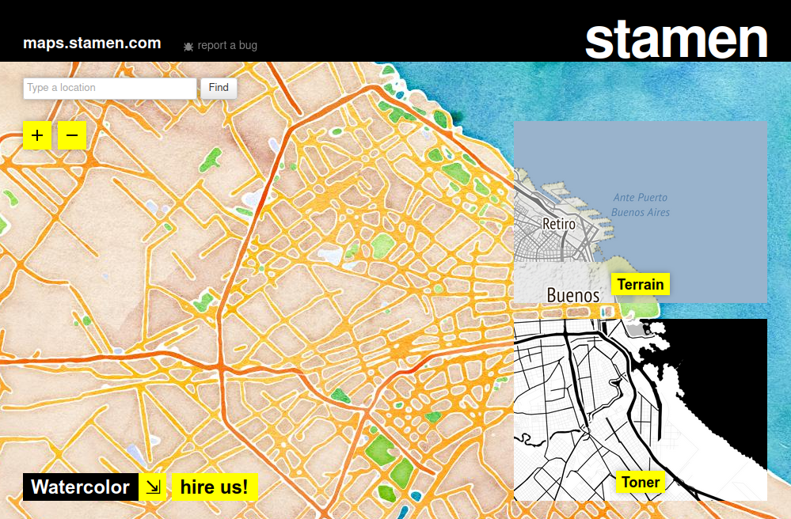

# Trabajando con datos espaciales y temporales

```{r echo=FALSE, out.width="100%"}

set.seed(42)
```


Hasta hace poco tiempo, labores como la producción de mapas y el análisis espacial estaban reservadas para especialistas. La complejidad de las tareas y al alto costo de producción y adquisición de datos geográficos funcionaban como barrera difícil de superar. Pero durante las dos últimas décadas la tecnología digital cambió el panorama. Una brusca caída en el costo asociado a adquirir y procesar información geográfica (pensemos en satélites y computadoras multiplicándose y bajando de precio) dio paso al mapa digital como herramienta universal. El consumo de sofisticados mapas y otros productos geográficos se volvió masivo y cotidiano, con _Google Maps_ como el exponente más conocido. Apenas había pasado la novedad de disponer de mapas en alta resolución de todo el mundo accesibles al instante desde nuestros escritorios, cuando la llegada de los _smartphones_ popularizó el acceso en cualquier momento y lugar.

El mismo proceso que nos convirtió a todos en consumidores constantes de información geográfica también nos da la oportunidad de ser los productores. Sin dudas, hacer mapas se ha vuelto más fácil que nunca antes. Existen cada vez más repositorios con información georreferenciada de acceso publico, datasets que incluyen información precisa sobre la ubicación geográfica de sus registros. Al mismo tiempo, maduran y se hacen más fáciles de usar las herramientas para análisis y visualización espacial. 

En los procesos sociales, el "dónde" suele ser un aspecto clave. Es central para quienes estudiamos -por ejemplo- las ciudades o las dinámicas de la política, siempre tan arraigadas a lo territorial. Esto vuelve al mapa una de las herramientas de visualización más importantes que podemos emplear.

Del mismo modo, también crece la disponibilidad datos que incluyen fecha y hora. Para entender datasets con datos en gran volumen que poseen atributos de posición y tiempo, es útil visualizar el ritmo en el que ocurren (diario, mensual, anual, etc) tanto como la forma en la que se distribuyen en el espacio.


## Trabajando con fechas

Continuemos aprovechando el dataset con delitos registrados durante el 2020 en Buenos Aires, ahora para practicar el manejo de fechas y horas.

Esta vez usaremos una versión aún más completa, que incluye columnas con la fecha completa, la hora, y la ubicación de cada incidente:

```{r}
delitos <- read.csv("https://cdaj.netlify.app/data/delitos_fecha_lugar.csv")
```

Las primeras filas del dataset lucen así (:

```{r echo=FALSE}
head(delitos, 50)
```

Teniendo en cuenta que el dataset es del 2020, el Primer Año de la Pandemia COVID, nos podríamos preguntar si se ve algún descenso brusco en robos, hurtos, homicidios o siniestros viales con el inicio de la cuarentena. Para responder eso, vamos a tener que lidiar con datos de tipo "fecha". Esto podría ser bastante engorroso, pero por suerte podemos usar una herramienta que simplifica las cosas.


### La fecha como clase de variable

La fecha es un tipo de dato que puede ser expresado de muchas maneras, dependiendo de que nos interese tener en cuenta: el día de la semana al que corresponde, el mes, el año, etc. El paquete [`lubridate`](https://lubridate.tidyverse.org/) hace fácil tomar una variable que contiene fechas en cualquier formato (por ejemplo "20/07/2020") para extraer el atributo relacionado que deseemos (como su día, "lunes", o su mes, "julio").

Para empezar, convertimos el campo "fecha" al tipo de dato especializado, que se llama... fecha (_date_). Aquí tenemos que prestar atención al formato en que aparecen los datos de la columna, en general algo como "30-07-2018" (día, mes, año) o "30-07-2018 12:14:24" (día, mes, año y hora, minutos, segundos). Con nuestros datos se da el primer caso, por lo cual la función para convertir ese campo en fecha es `dmy()`; para el segundo caso, seria `dmy_hms()`


```{r}
library(lubridate)

delitos$fecha <- dmy(delitos$fecha)
```

::: tip
`lubridate` usa un formato memotécnico para nombrar sus funciones de conversión de texto a fecha. 
Para saber que función utilizar según el formato en que aparecen las fechas, es cuestión de determinar en que orden aparecen año, mes y día (y horas y minutos si estuvieran).

Por ejemplo, un campo que registran fechas en formato similar a "4/26/17" o a "4-26-2017" implica "mes - día - año" y por tanto en ambos casos puede convertirse a fecha con `mdy()` (la "y" es por _year_). 
:::

Repasemos algunas de los nuevos trucos que podemos hacer con el tiempo. Tomemos cinco fechas elegidas al azar:

```{r}
muestra_de_fechas <- sample(delitos$fecha, 5)

muestra_de_fechas
```

Mediante las funciones disponibles en `lubridate`, podemos extraer:

- El día de la semana al que corresponde cada fecha:

```{r fechas1, exercise=TRUE}
wday(muestra_de_fechas)
```

```{r fechas2, exercise=TRUE}
wday(muestra_de_fechas, label = TRUE)
```
- El mes:

```{r fechas3, exercise=TRUE}
month(muestra_de_fechas)
```


```{r fechas4, exercise=TRUE}
month(muestra_de_fechas, label = TRUE)
```

- El año:

```{r fechas5, exercise=TRUE}
year(muestra_de_fechas)
```

Y varias opciones más, que se pueden repasar en https://cran.r-project.org/web/packages/lubridate/vignettes/lubridate.html

Con lo visto hasta aquí, tenemos suficiente para mostrar patrones temporales en los datos.

Empecemos por un gráfico de barras (`geom_bar()`) con la cantidad de eventos registrados por mes. Para que aparezca un conteo por mes del año, asignaremos al eje de las $x$ el _mes_ al que corresponde cada valor de la columna "fecha", o sea `month(fecha, label = TRUE)`:


```{r eval=FALSE}
library(tidyverse) # cargamos la librería en caso de no haberlo hecho antes
```


```{r}
ggplot(delitos) + 
    geom_bar(aes(x = month(fecha, label = TRUE)))
```

(Hemos usado el parámetro `label = TRUE` para obtener el nombre del mes en lugar de su número, o sea "dic" en lugar de "12". Prueben realizar el gráfico sin ese parámetro en la llamada a `month()` para ver que pasa.)

En el gráfico, se ve una reducción drástica a partir de la cuarentena decretada en abril. Y también un incremento gradual y sostenido a partir de allí, que de todos modos no llega a los niveles pre-pandemia de enero y febrero. 

Para ver la composición interna de los conteos mensuales, cuantos casos corresponden a cada categoría, podemos hacer un gráfico de "barras apiladas" como vimos en la clase 3. La sintaxis es igual que antes, pero esta vez asignamos la variable _tipo_"_ al color de relleno de las barras determinado por el parámetro `fill`. 


```{r}
ggplot(delitos) + 
    geom_bar(aes(x = month(fecha, label = TRUE), fill = tipo))
```

Las barras apiladas son prolijas, pero pueden hacer difícil evaluar la evolución de categorías individuales. Recordemos que para mostrar los subconjuntos en barras independientes, una al lado de la otra, podemos usar el parámetro `position = "dodge"`. Inténtenlo agregando el parámetro al ejercicio anterior para ver como queda.

Ahora comparemos la cantidad de eventos registrados, por tipo, para cada día de la semana. Basta con usar la función que extrae el día de la semana, `wday()`, en lugar de `month()`. Lo demás es idéntico, incluyendo el uso de `label = TRUE` para que obtener el nombre del día -"lun"-, en lugar de su posición en la semana -"2", porque para `lubridate` las semanas empiezan el domingo-. 


```{r}
ggplot(delitos) + 
    geom_bar(aes(x = wday(fecha, label = TRUE), fill = tipo))
```

Como era de esperar, durante los fines de semana se observa una menor cantidad de eventos, aunque quizás no en la categoría Homicidio, que es difícil de discernir por su relativa escasez. Para solucionar el problema podríamos filtrar los datos antes de visualizarlos, como hemos hecho antes con la función `filter()`, mostrando sólo la categoría de interés. 

Otra opción, que probaremos ahora, es una visualización en "facetas". Se trata de generar una visualización que muestra distintos aspectos de los datos en paneles separados. Con un ejemplo vamos a dejarlo mas claro. Para realizar un gráfico en facetas, basta con sumar una línea con la función `facet_wrap(vars(x, y, ...))`, dónde "x", "y", etc son los nombres de las variables cuyas categorías recibirán paneles distintos. Intentémoslo con el último gráfico, agregando "tipo" como variable a facetar:


```{r}
ggplot(delitos) + 
    geom_bar(aes(x = wday(fecha, label = TRUE), fill = tipo)) +
    facet_wrap(vars(tipo))
```

Obtuvimos barras separadas, pero los homicidios siguen difíciles de distinguir. Se debe a que por defecto `facet_wrap()` mantiene a escala todos los paneles, de manera que se puedan comparar cantidades de forma directa. La desventaja es que se pierde legibilidad de categorías con valores ínfimos en comparación con otras. Por eso disponemos del parámetro `scales`, que permite graficar los datos con escala libre, vía `scales = "free"`. Probemos:

```{r}
ggplot(delitos) + 
    geom_bar(aes(x = wday(fecha, label = TRUE), fill = tipo)) +
    facet_wrap(vars(tipo), scales = "free")
```
Ahora queda más claro que los homicidios siguen un patrón diario distinto al de las demás categorías. También que, en términos relativos, las lesiones son las que mas se reducen durante los fines de semana.

También podemos evaluar el ritmo según la hora del día. ¿Cómo se haría con nuestro dataset? 

## Mirando al espacio

Pasemos ahora al análisis espacial de nuestros datos. Para facilitar la visualización volveremos a usar el paquete `ggmap`, que aporta funciones que facilitan la creación de mapas.

```{r}
library(ggmap)
```

### Obteniendo un mapa base

Para dar contexto que guíe a la audiencia es útil proyectar nuestra información georreferenciada sobre un mapa de fondo que muestre la posición de caminos, nombres de localidades, accidentes geográficos y otros hitos. Estos mapas usados como lienzo sobre el cual mostrar datos espaciales son conocidos como "mapas base", o _basemaps_. Guardar por nuestra cuenta información cartográfica con alto nivel de detalle de cualquier lugar del mundo es impracticable, pero por suerte existen servicios en internet que lo hacen por nosotros como [Stamen Maps](http://maps.stamen.com), ¡que es de uso gratuito!.

```{r echo=FALSE, fig.align="center", out.width="85%"}

```
<center>
_El sitio web de Stamen Maps_

</center>

Para incluir mapas base en nuestras visualizaciones podemos usar las funciones del paquete [`ggmap`](https://github.com/dkahle/ggmap), que complementa a ggplot agregando funciones que permiten adquirir y visualizar mapas en forma fácil.

Lo activamos:

```{r eval=FALSE}
library(ggmap)
```

Ahora, para obtener un mapa base del área donde se encuentran los datos que queremos mostrar, necesitamos determinar su “bounding box”: el rango de latitud y longitud que forma un rectángulo conteniendo todas sus posiciones. En resumidas cuentas, se trata de los valores de latitud máxima y mínima, y de longitud máxima y mínima, de nuestros datos georreferenciados.

Los proveedores de mapas online suelen solicitar los valores en este orden: izquierda, abajo, derecha, arriba. Es decir, posición mas al oeste, posición mas al sur, posición mas al este, posición mas al norte. 
Cuando disponemos de un daataframe georreferenciado, obtener la _bounding box_ de su contenido es bastante fácil usando `st_bbox`, una función del paquete `sf` que recupera esas cuatro coordenadas clave. Por ejemplo `st_bbox(radios)` obtiene las coordenadas del rectángulo de territorio que abarca los radios censales de Buenos Aires. Luego de guardar las coordenadas en una variable, les ponemos los nombres que permitirán que `ggmap` las identifique:


Para obtener un mapa de fondo o "mapa base" necesitamos obtener una _bounding box_ de nuestros datos: el rango de latitud y longitud que forma un rectángulo conteniendo todas sus posiciones. En resumidas cuentas, se trata de los valores de latitud máxima y mínima, y de longitud máxima y mínima, de nuestros datos georreferenciados.
No es algo que deba preocuparnos demasiado, porque podemos obtener esta información con una simple función incluida en `ggmap`:

```{r}
bbox <- make_bbox(delitos$longitud, delitos$latitud)

bbox
```

En base a la "bounding box" solicitamos nuestro mapa base:

```{r}
CABA <- get_stamenmap(bbox = bbox, maptype = "toner", zoom = 12)
```

Para verlo:

```{r}
ggmap(CABA)
```

::: tip
Stamen ofrece varios estilos de mapa base, que pueden revisarse en su [sitio web](http://maps.stamen.com). 
Entre ellos: 

- `terrain` (usado por defecto)
- `toner` (monocromático, buena opción para visualizar datos proyectados por encima)
- `toner-lite` (versión alternativa de toner, con menos contraste visual)
- `watercolor` (hay que probarlo para apreciarlo, pero digamos que es artístico)

Se adquieren usando el parámetro _maptype_. 
Por ejemplo, `get_stamenmap(bbox = bbox, maptype = "watercolor", zoom = 12)`
:::

### De coordenadas al mapa

De aquí en más podemos suporponer nuestros datos en distintas capas sobre el mapa, con la misma sintaxis que conocemos de ggplot. Para mapear las ubicaciones de los delitos en el dataset, usamos `geom_point()` y los campos de longitud y latitud para los ejes $x$ e $y$:


::: warning
En ocasiones los datos de longitud y latitud son leídos como texto (tipo "chr"), en lugar de números. Si eso ocurre el mapeo no va a funcionar, porque necesita datos numéricos para latitud y longitud. Para solucionarlo, podemos intentar convertir las columnas de coordenadas a tipo numérico. Algo así como `misdatos$longitud <- as.numeric(misdatos$longitud)` 
:::

```{r}
ggmap(CABA) +
    geom_point(data = delitos, aes(x = longitud, y = latitud))
```

Aquí nos topamos con un problema habitual al trabajar con grandes volúmenes de datos. Hay tantos puntos proyectados sobre el mapa, que se hace imposible interpretar dónde existen más o menos. Hacemos algunos ajustes:

- un color que resalte más contra el mapa base, y que no se confunda con él
- un tamaño de punto más pequeño
- y aplicación de una ligera transparencia

Todo ello vía los atributos "color", "size" y "alpha". ¿Cuál es el valor ideal para cada uno? En general, hay que recurrir a la prueba y error para encontrar la receta justa. Probemos con `color = "orange"`, `size = 0.1` y `alpha = 0.1`:

```{r}
ggmap(CABA) +
    geom_point(data = delitos, aes(x = longitud, y = latitud),
               color = "orange", size = 0.1, alpha = 0.1)
```

Ahora si aparecen ciertos patrones, por ejemplo la mayor frecuencia de casos de casos cerca de las principales de circulación de la ciudad. Aún así, se hace difícil identificar de un golpe de vista las "zonas calientes", las áreas de máxima concentración. 

### Mapas de densidad

Una solución práctica para el problema de la cantidad de puntos es una técnica llamada "binning": dividir el espacio en una grilla de celdas, contar cuantos puntos caen dentro de cada una, y visualizar las cantidades agregadas. En el mundo `ggplot` esto se lleva a cabo con `geom_bind2d()`.

```{r}
ggmap(CABA) +
    geom_bin2d(data = delitos, aes(x = longitud, y = latitud))
```

Ahora si, resaltan las áreas de mayor concentración de incidentes. Se puede mejorar un poco el gráfico usando:

- una mayor cantidad de celdas para aumentar la resolución
- una escala de colores diseñada para ayudar a detectar diferencias por tonalidad, como Viridis.

la cantidad de celdas se define con el parámetro "bins", por ejemplo `bins = 100`. La escala de color Viridis, como ya habíamos visto, se agrega sumando una llamada a `scale_fill_viridis_c()` -porque aquí la data es continua, si fuera discreta usaríamos `scale_fill_viridis_d()`.

```{r}
ggmap(CABA) +
    geom_bin2d(data = delitos, aes(x = longitud, y = latitud), bins = 100) +
    scale_fill_viridis_c()
```


Una alternativa al _binning_ es la llamada _kernel density estimation_, muy utilizada en aplicaciones de análisis espacial para estimar la intensidad de una determinada variable en cualquier punto del área analizada, incluso en aquellos para los cuales no hay observaciones. La idea es asumir que los valores observados corresponden a una distribución continua sobre el espacio, y determinar cual es la más probable en base a los puntos donde existen datos. Podemos visualizar esta distribución estimada `geom_density2d_filled` así:

```{r}
ggmap(CABA) +
    geom_density2d_filled(data = delitos, aes(x = longitud, y = latitud), alpha = 0.5) 
```
Nótese que aplicamos transparencia usando el parámetro `alpha = 0.5`. ¿Por qué? ¿Qué pasa si lo quitamos?


### Visualizando multiples categorías

Hasta aquí hemos analizado la distribución espacial de eventos en su totalidad, sin diferenciar su tipo. Veamos ahora las diferencias por categoría. Podemos reintentar el mapa de puntos, esta vez diferenciándolos por color. Recuperamos el código que usamos antes para mostrar puntos, y esta vez asignamos la columna "tipo" al atributo estético `color`:


```{r}
ggmap(CABA) +
    geom_point(data = delitos, 
               aes(x = longitud, y = latitud, color = tipo),
               size = 0.1, alpha = 0.1)
```


Aquí tenemos dos problemas: 

* La leyenda ("tipo_delito") es difícil de leer, dado que muestra los puntos tal como los definimos: pequeños y con mucha transparencia. Esos atributos son útiles en el mapa, donde tenemos cientos de miles de puntos, pero muy poco prácticos para la leyenda, donde sólo hay un minúsculo punto por etiqueta.

* Los puntos sobre el mapa se superponen en tal medida que es difícil identificar patrones espaciales distintos según su categoría.

El primer problema se resuelve fijando "a mano" los atributos de la leyenda, asi:

```{r}
ggmap(CABA) +
    geom_point(data = delitos,
               aes(x = longitud, y = latitud, color = tipo),
               size = 0.1, alpha = 0.1) +
    guides(color = guide_legend(override.aes = list(size = 1, alpha = 1)))
```

El segundo, usando facetado para mostrar en su propio mapa a cada categoría:

```{r}
ggmap(CABA) +
    geom_point(data = delitos,
               aes(x = longitud, y = latitud, color = tipo),
               size = 0.1, alpha = 0.1) +
    guides(color = guide_legend(override.aes = list(size = 1, alpha = 1))) +
    facet_wrap(vars(tipo))
```

El facetado ayuda a que no se nos mezclen los colores, y hace evidente cuales categorías son mas frecuentes que otras. Pero  con nuestra abundancia de puntos no ayuda encontrar los sitios de alta concentración, y hace que se pierdan de vista los casos de la categoría poco frecuente (homicidios).

Para hacer las diferencias aún mas nítidas, podemos facetar una estimación de densidad en lugar de puntos. ¿Cómo lo haríamos?


```{r}
ggmap(CABA) +
    geom_density2d_filled(data = delitos, aes(x = longitud, y = latitud), alpha = 0.5) +
    facet_wrap(vars(tipo))
```

## Combinando espacio y tiempo


El facetado también nos permite visualizar el cambio de posición a través del tiempo.

Por ejemplo, podemos comparar cierto tipo delito (hurto sin violencia) mostrando dónde ocurre en cada día de la semana.

Primero activamos el paquete `dplyr` para acceder a su función de filtrado de datos,

```{r}
library(dplyr)
```

Y luego mostramos sólo las filas del dataframe donde la columna tipo contiene "Homicidio", 
 - en forma de puntos en el mapa (`geom_point()`), 
 - con el "subtipo" de homicidio representado por el `color` de los puntos
 - y un facetado por día de la semana (`facet_wrap(vars(wday(fecha, label = TRUE)))`)


```{r}
ggmap(CABA) +
    geom_point(data = filter(delitos, tipo == "Homicidio"),
               aes(x = longitud, y = latitud, color = subtipo), alpha = .5) +
    facet_wrap(vars(wday(fecha, label = TRUE)))

```

Vale aclarar que el poco elegante `facet_wrap(vars(wday(fecha, label = TRUE)))` podría cambiarse por un más legible `facet_wrap(vars(dia_semana))` si como paso previo agregamos al dataframe la columna "dia_semana", guardando allí el valor obtenido con `wday()`. 

Volviendo al tiempo y el espacio, también podemos concentrarnos en un tipo de delito en particular, y evaluar en que zonas se concentra de acuerdo a la hora del día. Nuestra data ya tiene la hora del día declarada en una columna, "franja". Si no fuera así, y tuviéramos la hora como parte de la fecha (estilo "2020-09-18 14:00:00") podríamos obtenerla con ayuda de `hour()` que funciona de forma similar a las ya vistas `month()` y `wday()`.

Entonces, mostremos sólo las filas del dataframe donde la columna tipo contiene "Hurto (sin violencia)", 
 - en forma de mapa de densidad (`geom_density2d_filled()`), 
 - y un facetado por hora del día (`facet_wrap(vars(franja))`)


```{r}
ggmap(CABA) +
    geom_density2d_filled(data = filter(delitos, tipo == "Hurto (sin violencia)"),
               aes(x = longitud, y = latitud), alpha = .5) +
    facet_wrap(vars(franja))
```

En el resultado se puede ver como los hurtos se concentran nítidamente en las áreas de mayor actividad comercial durante el día (lo que los porteños llaman "el centro"), sobre todo desde el mediodía hasta 4 o 5 de la tarde, cuando pierde intensidad y se dispersa en la dirección de las principales avenidas de la ciudad. 

Para terminar, pulimos la visualización 
 - filtrando las filas que registran la franja horaria como desconocida (`!is.na(franja)`)
 - retirando la leyenda, ya que nos interesa mostrar como se mueve la densidad a lo largo del día más que las cantidades
 - eligiendo la cantidad de filas en la que se distribuirán las facetas  (`nrow = 4`)
 - agregando título, subtítulo, y nota al pie con fuente
 - eligiendo un tema apropiado

```{r}
ggmap(CABA) +
    geom_density2d_filled(data = filter(delitos, !is.na(franja), tipo == "Hurto (sin violencia)"),
               aes(x = longitud, y = latitud), alpha = .5) +
    guides(fill = FALSE) +
    facet_wrap(vars(franja), nrow = 4) +
    labs(title = "Ciudad de Buenos Aires: concentración espacial de hurtos",
         subtitle = "según hora del día, durante el año 2020",
         caption = "fuente: https://mapa.seguridadciudad.gob.ar") +
    theme_void()
```


## Ejercicios

I.X

II.X

III. X


---

Con eso cerramos el capítulo, y el manual.

Esperamos haber provisto una introducción satisfactoria al análisis, modelado y visualización de información, y que haya sido tan sólo el inicio de un largo y gratificante recorrido.

¡Gracias por haber llegado hasta aquí! 
